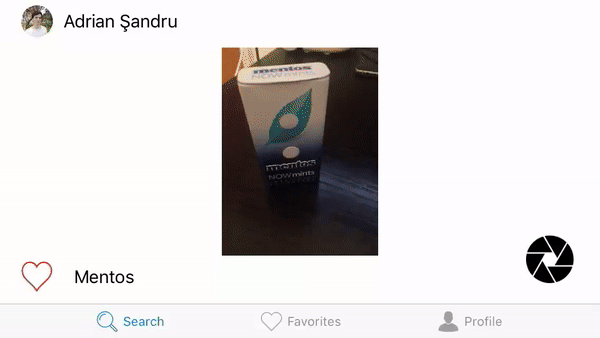

# PubsGuide

A school project for iOS course.

The goal of this app is to help people who are looking for a great place to eat or drink with their friends.

Users can authenticate using their Facebook accounts. Through this app they can access a feed with the latest posts and they can create a list of favorites.

The location will always be visible at the very bottom of the post, so that you won't get lost ;)

Project objectives:
- use web services
- use CocoaPods
- implement an operation with camera
- use CollectionView
- use a navigation method: Navigation Controller or Tab Bar Controller
- use maps
- social login
- adapt UI for landscape mode
- integrate SFSafariViewController

There are many things to do to make this application ready for production. This application can be viewed as a structure for further development.
